<a name="top"></a>

<div align="center">
  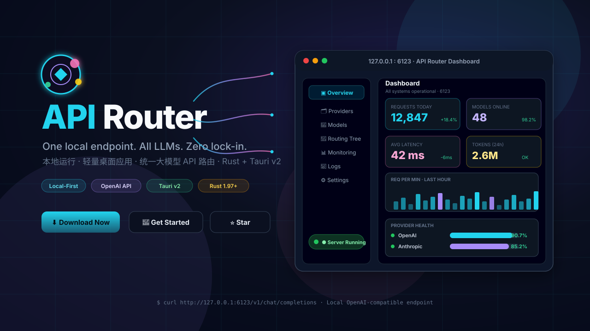
</div>

<br/>

<div align="center">
  <h3><samp>
    <code>http://127.0.0.1:6123</code>
  </samp></h3>
  <p>一个本地端点，调用所有大模型。<br/>
  <em>One local endpoint. All LLMs. Zero lock-in.</em></p>
</div>

<br/>

<div align="center">

  [](LICENSE)
  [](https://www.rust-lang.org/tools/install)
  [](https://vuejs.org/)
  [](https://tauri.app/)

  <br/>

  [](https://github.com/xf2214/api-router/stargazers)
  [](https://github.com/xf2214/api-router/releases)
  [](.github/workflows/ci.yml)
  [](#)

</div>

<br/>

<div align="center">
  <samp>
  <kbd><a href="#quick-start">🚀 快速开始</a></kbd>
  &nbsp;·&nbsp;
  <kbd><a href="#releases">📥 Release 下载</a></kbd>
  &nbsp;·&nbsp;
  <kbd><a href="#showcase">🖼️ 功能展示</a></kbd>
  &nbsp;·&nbsp;
  <kbd><a href="#architecture">🏗️ 架构原理</a></kbd>
  &nbsp;·&nbsp;
  <kbd><a href="#faq">❓ 常见问题</a></kbd>
  </samp>
  <br/><br/>
  <strong>中文</strong> · <a href="README.en-US.md">English</a>
</div>

---

## ✨ 核心特性

> API Router 是一款**本地运行**的轻量级桌面应用，使用 Tauri v2 + Rust + Vue 3 + TypeScript 构建。将多个大模型厂商的 API 统一封装成本地 OpenAI 兼容端点，配置一次即可通过单一地址调用所有模型。

<br/>

<table align="center" width="100%" border="0" cellspacing="0" cellpadding="8">
  <tr>
    <td width="50%" valign="top">
      <div style="border:1px solid #1e293b;border-radius:14px;padding:20px 22px;background:#0b1020;height:100%">
        <h4 align="center" style="margin:0 0 8px 0;color:#22d3ee">🔗 统一 OpenAI 兼容接口</h4>
        <p align="center" style="margin:0;color:#94a3b8;font-size:14px;line-height:1.6">
          本地暴露标准端点：<br/>
          <code>/v1/models</code> · <code>/v1/chat/completions</code><br/>
          <code>/v1/completions</code> · <code>/v1/embeddings</code>
        </p>
      </div>
    </td>
    <td width="50%" valign="top">
      <div style="border:1px solid #1e293b;border-radius:14px;padding:20px 22px;background:#0b1020;height:100%">
        <h4 align="center" style="margin:0 0 8px 0;color:#a78bfa">🗂️ 多提供商管理</h4>
        <p align="center" style="margin:0;color:#94a3b8;font-size:14px;line-height:1.6">
          支持 OpenAI · Anthropic · Gemini · Azure<br/>
          DeepSeek · 智谱 · SenseNova · OpenRouter<br/>
          新增 / 编辑 / 删除 / 启用禁用 / 健康检查
        </p>
      </div>
    </td>
  </tr>
  <tr>
    <td width="50%" valign="top">
      <div style="border:1px solid #1e293b;border-radius:14px;padding:20px 22px;background:#0b1020;height:100%">
        <h4 align="center" style="margin:0 0 8px 0;color:#34d399">🧭 智能模型路由</h4>
        <p align="center" style="margin:0;color:#94a3b8;font-size:14px;line-height:1.6">
          本地别名映射到多个上游后端<br/>
          策略：<strong>顺序优先</strong> · <strong>权重随机</strong> · <strong>轮询</strong><br/>
          支持 Tier 分层 + Group 分组路由
        </p>
      </div>
    </td>
    <td width="50%" valign="top">
      <div style="border:1px solid #1e293b;border-radius:14px;padding:20px 22px;background:#0b1020;height:100%">
        <h4 align="center" style="margin:0 0 8px 0;color:#f59e0b">🛡️ 高可靠性</h4>
        <p align="center" style="margin:0;color:#94a3b8;font-size:14px;line-height:1.6">
          失败<strong>重试</strong> · Fallback <strong>降级</strong><br/>
          <strong>熔断器</strong> · QPS/并发<strong>限流</strong><br/>
          健康检查与后端<strong>自动隔离</strong>
        </p>
      </div>
    </td>
  </tr>
  <tr>
    <td width="50%" valign="top">
      <div style="border:1px solid #1e293b;border-radius:14px;padding:20px 22px;background:#0b1020;height:100%">
        <h4 align="center" style="margin:0 0 8px 0;color:#f472b6">📡 流式与非流式透传</h4>
        <p align="center" style="margin:0;color:#94a3b8;font-size:14px;line-height:1.6">
          完整支持 SSE 流式响应<strong>字节级转发</strong><br/>
          客户端 stream 字段优先 · 默认开启流式<br/>
          延迟无感、内存零暴涨
        </p>
      </div>
    </td>
    <td width="50%" valign="top">
      <div style="border:1px solid #1e293b;border-radius:14px;padding:20px 22px;background:#0b1020;height:100%">
        <div align="center">
          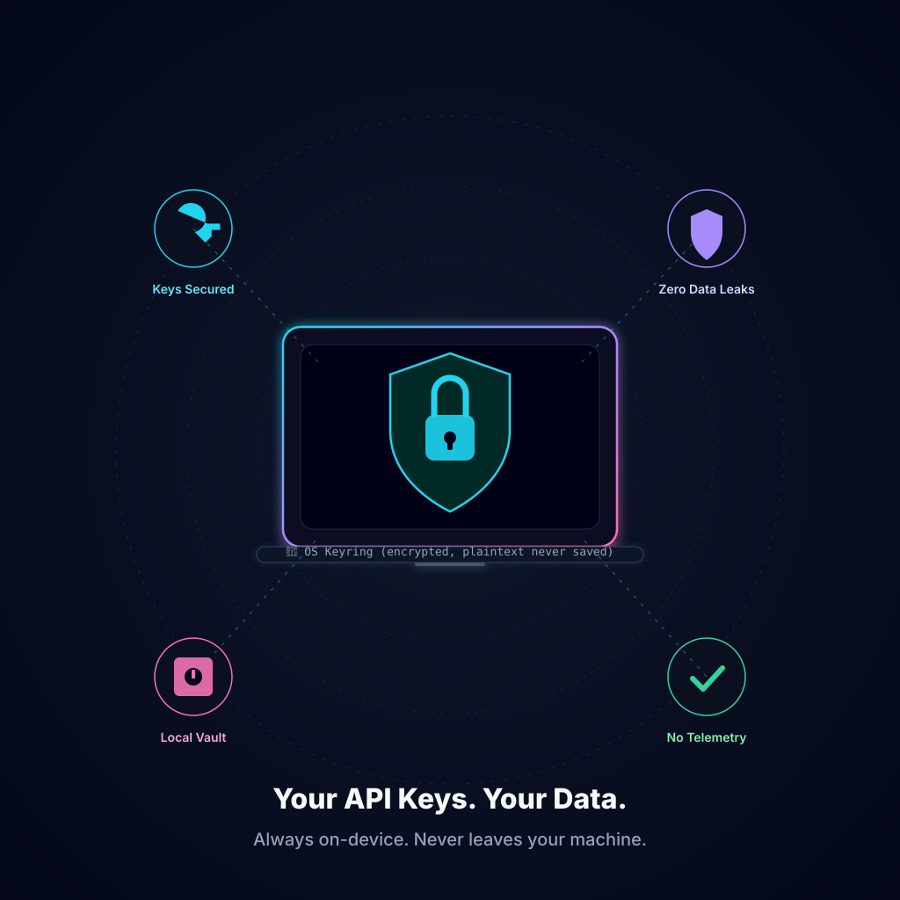
        </div>
        <h4 align="center" style="margin:0 0 8px 0;color:#22d3ee">🔒 本地优先 · 隐私安全</h4>
        <p align="center" style="margin:0;color:#94a3b8;font-size:14px;line-height:1.6">
          所有数据留在本机<br/>
          API Key 使用系统钥匙串加密存储<br/>
          <strong>配置文件不落明文</strong>
        </p>
      </div>
    </td>
  </tr>
  <tr>
    <td width="50%" valign="top">
      <div style="border:1px solid #1e293b;border-radius:14px;padding:20px 22px;background:#0b1020;height:100%">
        <h4 align="center" style="margin:0 0 8px 0;color:#fb7185">📊 实时监控统计</h4>
        <p align="center" style="margin:0;color:#94a3b8;font-size:14px;line-height:1.6">
          服务状态 · 已配置模型数<br/>
          当日请求数 · 请求<strong>延迟分布</strong><br/>
          Token 用量 · 请求日志搜索与导出
        </p>
      </div>
    </td>
    <td width="50%" valign="top">
      <div style="border:1px solid #1e293b;border-radius:14px;padding:20px 22px;background:#0b1020;height:100%">
        <h4 align="center" style="margin:0 0 8px 0;color:#60a5fa">💻 跨平台桌面</h4>
        <p align="center" style="margin:0;color:#94a3b8;font-size:14px;line-height:1.6">
          ⚪ <strong>Windows 10 / 11</strong> x64 （优先支持）<br/>
          🍎 macOS 12+ · Intel / Apple Silicon<br/>
          安装包 < 30 MB · 内存 < 150 MB
        </p>
      </div>
    </td>
  </tr>
</table>

---

<a name="architecture"></a>
## 🏗️ 架构原理

> 四层数据流：你的应用 → 本地 HTTP 服务 → Rust 路由核心 → 上游大模型 API。所有密钥与配置均在本机处理。

<div align="center">
  <a href="docs/images/architecture-diagram.svg" target="_blank">
    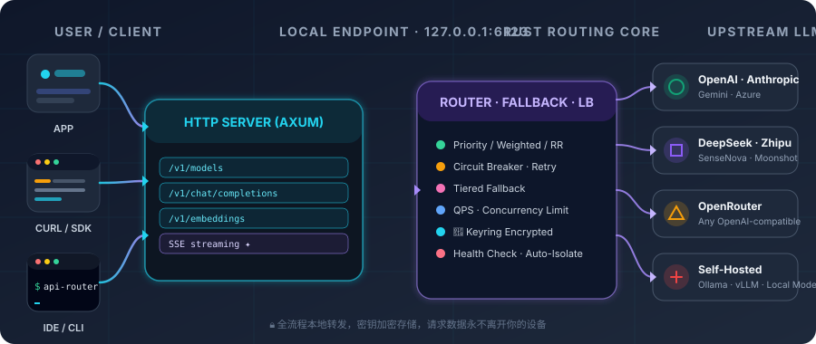
  </a>
  <p><em>▲ 点击查看完整 SVG 架构图（矢量，可无限放大）。详细文档见 <a href="docs/ARCHITECTURE.md">ARCHITECTURE.md</a>。</em></p>
</div>

---

<a name="showcase"></a>
## 🖼️ 功能展示 Gallery

> 所有截图均来自真实产品界面。点击任意图片可查看原图。

<div align="center">

| 概览仪表盘 · Overview | 多提供商管理 · Providers |
|:---:|:---:|
| [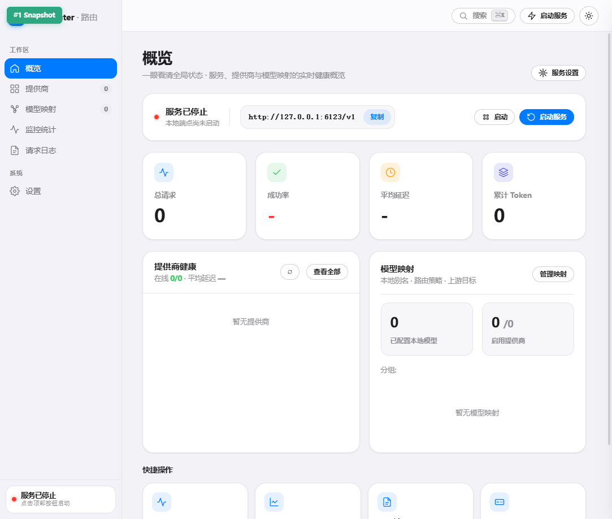](docs/images/01-overview.png) | [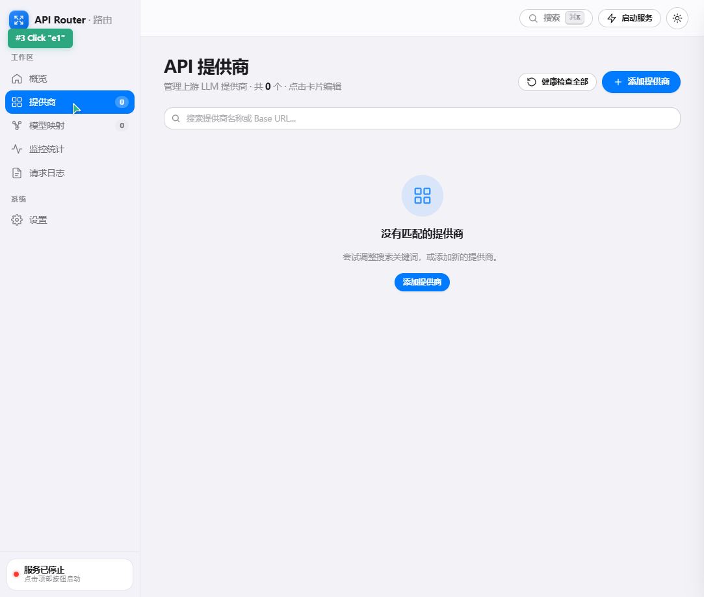](docs/images/02-providers.png) |
| 服务状态 · 核心指标 · 提供商健康度 | 增删改查 · 健康检查 · 自动拉取模型列表 |

| 提供商表单 · Provider Form | 模型路由树 · Routing Tree |
|:---:|:---:|
| [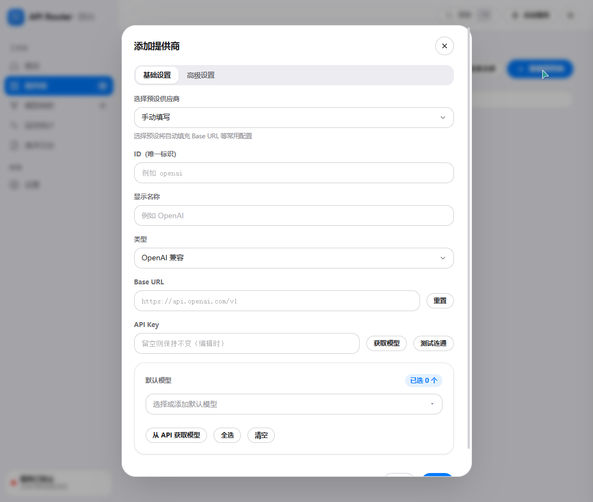](docs/images/03-provider-form.png) | [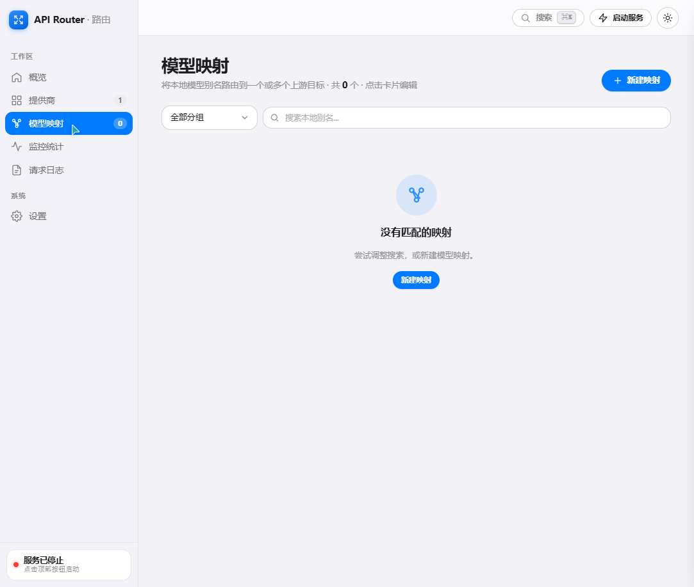](docs/images/05-routing.png) |
| Base URL · API Key · 模型勾选 · 高级设置 | 分组 · Tier 分层 · 权重 · 顺序 · 轮询 |

| 监控统计 · Monitoring | 请求日志 · Logs |
|:---:|:---:|
| [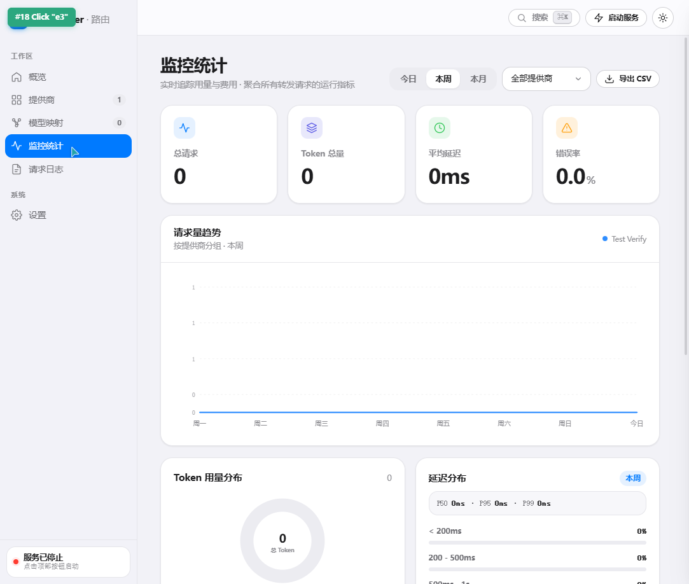](docs/images/06-monitoring.png) | [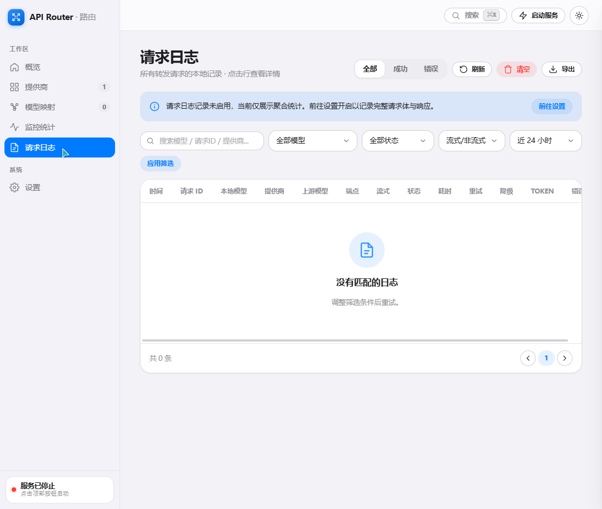](docs/images/07-logs.png) |
| 按提供商/模型聚合 · 延迟 · Token · 成功率 | 实时请求明细 · 搜索筛选 · CSV 导出 · 详情面板 |

| 提供商卡片详情 · Provider Detail | 系统设置 · Settings |
|:---:|:---:|
| [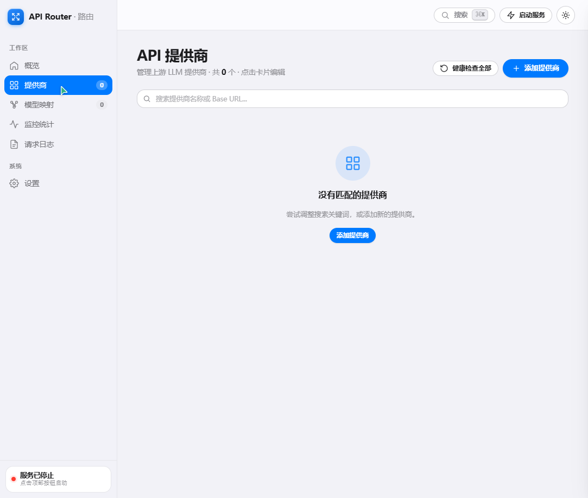](docs/images/04-provider-card-detail.png) | [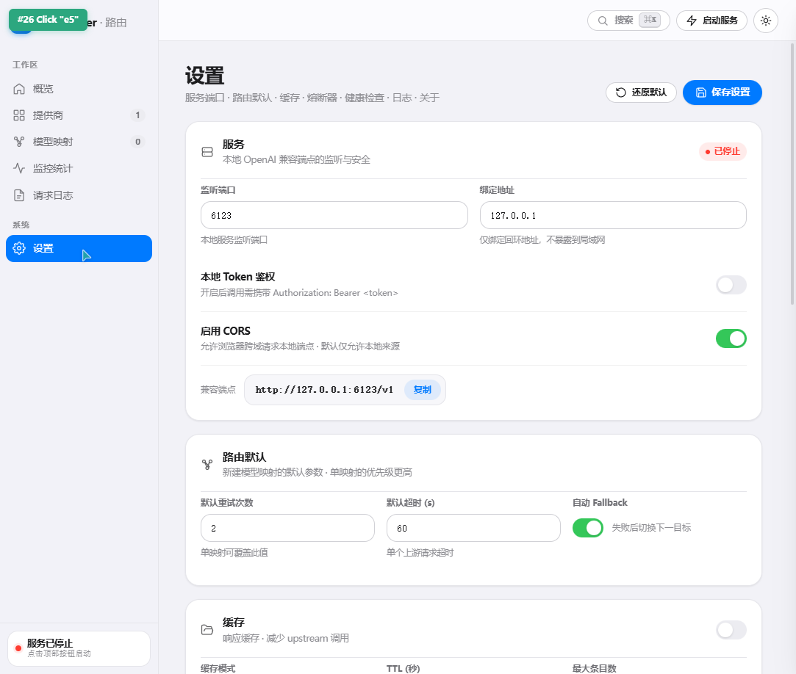](docs/images/08-settings.png) |
| 延迟进度条 · 状态徽章 · 快捷操作 | 端口 · 密钥 · 超时 · 熔断 · 缓存 · 主题 · 关于 |

</div>

---

<a name="quick-start"></a>
## 🚀 快速开始

### ① 安装依赖

| 依赖 | 版本要求 | 说明 |
|------|:--------:|------|
| 🦀 Rust | ≥ 1.97.1 | [官方安装器](https://www.rust-lang.org/tools/install) |
| 🟢 Node.js + npm | LTS 推荐 | [Node.js 官网](https://nodejs.org/) |
| 🛠 WiX / NSIS | 可选 | 仅在 Windows **生成安装包**时需要（[WiX](https://wixtoolset.org/) / [NSIS](https://nsis.sourceforge.io/)） |

### ② 克隆 & 安装

```bash
git clone https://github.com/xf2214/api-router.git
cd api-router
npm install
```

### ③ 启动开发环境

```bash
npm run tauri:dev
```

### ④ 配置你的第一个提供商

1. 打开应用 → 🗂️ **提供商** 页 → 点击 **+ 添加提供商**
2. 填写 **名称** · **Base URL** · **API Key**
3. 点击 **🔍 获取模型**，勾选需要使用的模型 → **保存**
4. ✅ 应用会自动为选中的模型创建**本地映射**

### ⑤ 调用本地 API 🎉

```bash
curl http://127.0.0.1:6123/v1/chat/completions \
  -H "Content-Type: application/json" \
  -d '{
    "model": "gpt-4o",
    "messages": [{"role": "user", "content": "Hello, API Router!"}],
    "stream": false
  }'
```

> 📖 完整接口规范见 [docs/API_SPEC.md](docs/API_SPEC.md)，用户使用教程见 [docs/USER_GUIDE.md](docs/USER_GUIDE.md)。

---

<a name="releases"></a>
## 📥 Release 下载说明

<div align="center">

  
  
  

</div>

<br/>

> ✅ **当前阶段：Windows + macOS 均由 GitHub Actions 在推送版本标签后自动构建并发布**。Linux / 移动端暂无近期发布计划。

### 🪟 支持的 Windows 版本

| 条目 | 要求 |
|------|------|
| **操作系统** | Windows 10 21H2 / Windows 11（x64，64 位） |
| **架构** | AMD64 / Intel x86_64（⚠️ ARM64 暂不提供安装包，需自行构建） |
| **WebView2 Runtime** | 一般 Win11 已预装；Win10 若缺失安装程序会提示，或[手动下载](https://developer.microsoft.com/microsoft-edge/webview2/) |
| **最低内存** | 2 GB RAM |
| **空闲磁盘** | ≥ 200 MB（含安装包 + 本地缓存 + 日志） |

### 📦 发行产物（v0.2.0）

| 安装包格式 | 推荐场景 | 文件名（示例） | 体积 |
|:-----------|:---------|:---------------|:----:|
| **NSIS `.exe`** ✅ | Windows 普通用户首选：双击向导式安装，支持卸载 | `API Router_0.2.0_x64-setup.exe` | ~25 MB |
| **WiX `.msi`** | Windows 企业部署 / SCCM / 组策略静默安装 | `API Router_0.2.0_x64_en-US.msi` | ~28 MB |
| **Universal DMG** 🍎 | macOS 12+（Intel / Apple Silicon） | `API Router_0.2.0_aarch64.dmg` 等 | — |

### 🔗 下载地址

最新版请前往 GitHub Releases 页面下载：

<div align="center">
  <samp>
  <kbd><a href="https://github.com/xf2214/api-router/releases/latest">
    
  </a></kbd>
  &nbsp;
  <kbd><a href="https://github.com/xf2214/api-router/releases/tag/v0.2.0">
    
  </a></kbd>
  </samp>
  <p><em>若 GitHub 访问缓慢，可使用镜像加速站（如 ghproxy / gh-proxy）。</em></p>
</div>

### ✅ 安装后验证

1. 从开始菜单或桌面快捷方式启动 **API Router**
2. 应用打开后，观察托盘区出现 🟢 图标
3. 浏览器或终端访问：

   ```bash
   curl -s http://127.0.0.1:6123/v1/models | head -c 300
   ```

4. 若返回 JSON（含 `"object": "list"`），说明本地服务运行正常 🎉

### 🔄 更新与卸载

- **更新**：下载新版本 `.exe` / `.msi` 直接覆盖安装（配置文件和 Keyring 密钥不受影响）
- **卸载**：Windows 设置 → 应用 → API Router → 卸载；或使用开始菜单中的「卸载 API Router」快捷方式
- **配置文件位置**：`%APPDATA%\com.api-router.app\config\config.yaml`（卸载时默认保留，需手动清理可勾选「删除用户数据」）
- **密钥存储**：Windows 凭据管理器 → 普通凭据 → `api-router.provider.*`

### 🍎 macOS & 🐧 Linux 进度（Coming Soon）

| 平台 | 状态 | 发布方式 | 备注 |
|------|:----:|:--------:|------|
| 🪟 **Windows x64** | ✅ 已发布 | 手动 / CI | MSI + NSIS 两种安装器 |
| 🍎 **macOS Universal 2** | ✅ CI 构建 | 版本标签自动发布 | DMG + .app，需签名 + notarize |
| 🐧 **Linux (deb / rpm / AppImage)** | 📝 规划中 | — | Tauri v2 原生支持，打包脚本待补充 |
| 📱 **Android / iOS** | ❌ 无计划 | — | 当前仅桌面端 |

> 构建 macOS 安装包需要一台 macOS 主机（12+）及 Xcode，详见 [docs/macos-build.md](docs/macos-build.md)。

---

## 📦 构建与发布

```bash
# 1) 前端生产包
npm run build

# 2) Rust release 构建（仅生成可执行文件，不打包安装程序）
cd src-tauri
cargo build --release
  # 产物位置：src-tauri/target/release/api-router(.exe)

# 3) 生成安装包（需要 WiX/NSIS，且构建脚本会访问 GitHub 下载 WebView 运行时）
cd ..
npm run tauri:build
  # Windows MSI: src-tauri/target/release/bundle/msi/API Router_<ver>_x64_en-US.msi
  # Windows NSIS: src-tauri/target/release/bundle/nsis/API Router_<ver>_x64-setup.exe
  # macOS DMG: src-tauri/target/release/bundle/dmg/API Router_<ver>_aarch64.dmg (macOS 构建)
```

> 🍎 macOS 通用二进制构建参考 [docs/macos-build.md](docs/macos-build.md)。

---

## 🧱 项目结构

```
api-router/
├── docs/                       # 项目文档
│   ├── images/                 # 本 README 引用的所有图片资源
│   ├── PRD.md                  # 产品需求文档
│   ├── ARCHITECTURE.md         # 技术架构文档
│   ├── API_SPEC.md             # 本地 API 规范
│   ├── USER_GUIDE.md           # 用户指南
│   ├── ROADMAP.md              # 开发路线图
│   └── UI_DESIGN_SPEC.md       # UI 设计规范
├── scripts/                    # 构建 / 发布辅助脚本
├── src/                        # 🟢 Vue 3 前端源码
│   ├── components/             # 通用组件 / 表单 / 页面片段
│   ├── pages/                  # 6 大页面: Overview/Providers/.../Settings
│   ├── services/tauri/         # 封装所有 Tauri IPC 调用
│   ├── stores/                 # Pinia-style reactive stores
│   ├── i18n/                   # zh-CN / en-US 双语言
│   └── composables/            # useTheme / useToast / useCsvExport 等
├── src-tauri/                  # 🦀 Rust + Tauri 后端核心
│   ├── src/
│   │   ├── config/             # 配置校验与 YAML 持久化
│   │   ├── core/               # 路由策略 / Tier 分层 / 分组算法
│   │   ├── infra/              # HTTP 客户端 · 熔断器 · 缓存 · 指标 · 转换
│   │   ├── server/             # Axum HTTP 服务 · SSE 流式转发
│   │   └── tauri_impl/         # 所有 #[tauri::command] 前端接口实现
│   ├── Cargo.toml
│   ├── tauri.conf.json         # 桌面应用元配置（窗口、图标、bundle）
│   └── build.rs
├── .github/workflows/ci.yml    # 三平台 CI：Rust checks · Frontend checks · Tauri smoke build
├── package.json
├── vite.config.ts
└── tsconfig.json
```

---

## 🛠️ 技术栈

<div align="center" style="display:flex;flex-wrap:wrap;gap:12px;justify-content:center;align-items:center;">
  
  
  
  
  
  
  
  
  
</div>

---

<a name="faq"></a>
## ❓ 常见问题

<details>
<summary><strong>Q: 为什么用 API Router，而不是直接用 LiteLLM / OpenRouter / Portkey？</strong></summary>
<br/>
<p>三者解决不同层面的问题：</p>
<ul>
  <li>☁️ <strong>OpenRouter / Portkey</strong> 是<strong>云端</strong>聚合服务，请求会经过第三方服务器，适合没有合规顾虑且希望「直接抄号」的场景；API Router <strong>100% 本地运行</strong>，所有请求从你的机器直发上游厂商。</li>
  <li>🐍 <strong>LiteLLM</strong> 是一个 Python 库，作为应用的一个依赖存在；API Router 是一个<strong>独立桌面应用</strong>，提供完整的可视化管理界面、健康检查、监控面板、日志查询与配置导入导出。</li>
  <li>🧩 <strong>组合使用完全可行</strong>：可以把 OpenRouter 作为 API Router 里的<strong>一个 Provider</strong>，其他直连厂商用 API Router 直接连，享受统一端点 + 本地密钥管理的便利。</li>
</ul>
</details>

<details>
<summary><strong>Q: 我的 API Key 存在哪里？安全吗？会上传吗？</strong></summary>
<br/>
<ul>
  <li>🔐 <strong>加密存储在操作系统原生凭据服务</strong>：Windows 使用 <em>Windows Credential Manager</em>，macOS 使用 <em>Keychain Access</em>，Linux 使用 <em>DBus Secret Service</em>——都通过 <a href="https://crates.io/crates/keyring">keyring</a>  crate 原生调用。</li>
  <li>🚫 配置文件 (<code>config.yaml</code>) 中<strong>只保存 provider id，不保存明文 Key</strong>，即使文件被盗也无法使用。</li>
  <li>✈️ API Router <strong>不向任何第三方云端发送任何遥测或凭据</strong>，所有请求目标只指向你配置的上游厂商 Base URL。</li>
</ul>
</details>

<details>
<summary><strong>Q: 支持哪些平台？Linux / Android / iOS 有计划吗？</strong></summary>
<br/>
<ul>
  <li>✅ <strong>Windows 10 / 11 x64</strong>：一等公民，CI 每笔提交验证。</li>
  <li>✅ <strong>macOS 12+ (Intel · Apple Silicon)</strong>：跟随跟进，提供通用二进制构建脚本（见 <a href="docs/macos-build.md">macos-build.md</a>）。</li>
  <li>🛠 <strong>Linux (deb/rpm/AppImage)</strong>：技术栈已完全支持（Tauri 2），仅需补安装包脚本与图标，<em>欢迎 PR</em>！</li>
  <li>📱 <strong>Android / iOS</strong>：暂不在路线图上，有需要可在 Issue 讨论。</li>
</ul>
</details>

<details>
<summary><strong>Q: 能配合哪些客户端应用使用？</strong></summary>
<br/>
<p>任何支持 <em>「自定义 OpenAI 兼容 Base URL」</em> 的客户端都可以直接用：</p>
<ul>
  <li>🤖 ChatBox / NextChat / LobeChat / OpenWebUI</li>
  <li>📝 Obsidian Smart Connections / Logseq Copilot</li>
  <li>💻 VS Code Continue / Cursor（指定 OpenAI 兼容端点）</li>
  <li>🎨 Anyquery / Dify / FastGPT / ……</li>
</ul>
<p>只要客户端能填 Base URL，就用 <code>http://127.0.0.1:6123/v1</code>，然后模型名填你在 API Router 里配置的本地别名即可。</p>
</details>

<details>
<summary><strong>Q: 如果某一个上游挂了，会怎样？</strong></summary>
<br/>
<ul>
  <li>自动进入<strong>Fallback 降级</strong>：按优先级尝试该模型的下一个后端目标（如果配置了多个）。</li>
  <li>单个后端连续失败会触发<strong>熔断器</strong>，在冷却时间内自动跳过该后端，避免雪崩。</li>
  <li>超过阈值后后端会被标为「不健康」，健康检查线程会周期性探测，恢复后再加入可用池。</li>
</ul>
</details>

---

## 📚 文档索引

| 文档 | 说明 |
|------|------|
| 📋 [产品需求文档](docs/PRD.md) | 产品定位、功能需求、成功指标 |
| 🏗️ [技术架构文档](docs/ARCHITECTURE.md) | 模块划分、数据流、核心设计决策 |
| 📡 [本地 API 规范](docs/API_SPEC.md) | OpenAI 兼容端点参数、响应格式、流式格式 |
| 🗺️ [开发路线图](docs/ROADMAP.md) | 里程碑规划、已完成 / 进行中 / 待办 |
| 🎨 [UI 设计规范](docs/UI_DESIGN_SPEC.md) | 页面布局、组件使用、密度 / 主题约定 |
| 🤖 [AI Agent 协作规范](docs/AGENTS.md) | 人类开发者与 AI Agent 协作规则、代码规范、质量门禁 |
| 👤 [用户指南](docs/USER_GUIDE.md) | 面向终端用户的界面使用教程 |
| 🍎 [macOS 构建文档](docs/macos-build.md) | macOS 平台通用二进制、签名与公证指南 |
| 📝 [版本变更日志](CHANGELOG.md) | 每版本新增 / 修复 / 已知限制 + 下载校验矩阵 |

---

## 🤝 贡献指南

我们欢迎 **Issue** 与 **Pull Request**！请阅读 [CONTRIBUTING.md](CONTRIBUTING.md)（[English version](CONTRIBUTING.en-US.md)）了解：
- 开发环境搭建
- Commit message 规范（Conventional Commits）
- Rust / TypeScript 代码规范
- 质量门禁与 CI 检查清单

请遵守 [CODE_OF_CONDUCT.md](CODE_OF_CONDUCT.md)（[English version](CODE_OF_CONDUCT.en-US.md)）中的社区行为准则：友善、尊重、包容。

---

## 📄 许可证

本项目基于 [MIT 许可证](LICENSE) 开源。

---

## 🙏 致谢

| 项目 | 用途 |
|------|------|
| [Tauri](https://tauri.app/) | 跨平台桌面框架，< 30 MB 安装包的关键 |
| [Rust](https://www.rust-lang.org/) | 路由核心、HTTP 服务、密钥管理的基础 |
| [Tokio](https://tokio.rs/) | 异步运行时 |
| [Axum](https://github.com/tokio-rs/axum) | 本地 HTTP 服务 (OpenAI-compatible endpoints) |
| [reqwest](https://github.com/seanmonstar/reqwest) | 上游 API 客户端 (rustls-tls) |
| [Vue 3](https://vuejs.org/) | 前端 UI |
| [keyring](https://crates.io/crates/keyring) | 跨平台凭据加密存储 |
| [shields.io](https://shields.io/) | 本 README 中使用的徽章 |

<br/>

<div align="center">
  <samp>
  <a href="#top">⬆ 返回顶部</a>
  &nbsp;·&nbsp;
  <a href="https://github.com/xf2214/api-router/issues/new/choose">🐛 报告 Bug / 💡 功能建议</a>
  </samp>
  <br/><br/>
  <sub>Made with 💙 using <code>Rust + Tauri + Vue 3</code> · 本地优先，数据不出户</sub>
</div>
